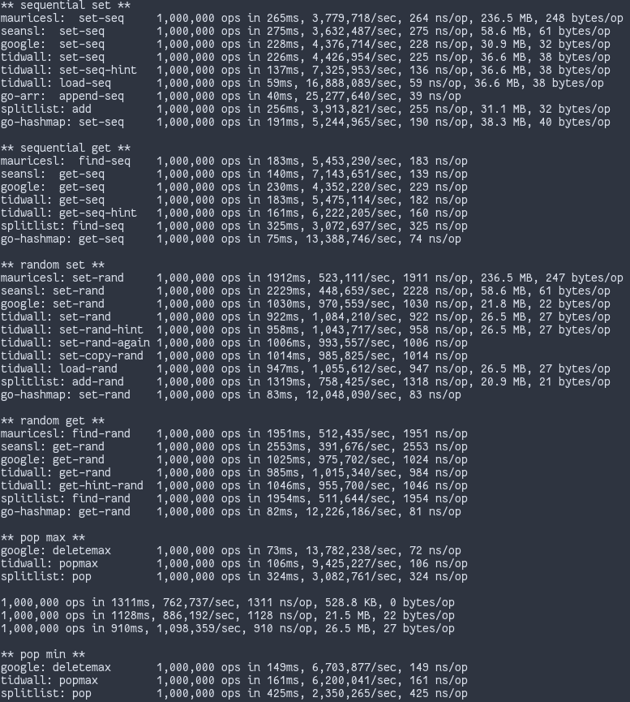

  

In this Repo you can find an experimental data structure, the SplitList.

It is a sort of different take on a B-Tree, that is a generalization of a Binary tree.

All you have to know about the B-Tree is that it has a parameter **B**, ~~surprisingly~~, that defines what is the **maximum**
amount of data that a tree **node** can have, in contrast, the Binary tree has only one data point per node.

The difference between the B-Tree and the Split List is in the way that we arrange the data.

Every time an element is added to the B-Tree, it recursively travels down the tree until it finds a node where it should
fit, on the SplitList each node goes to a **random** bucket, roughly the same as the node, inside an array, in such a way that the biggest array of
buckets will always have something close to half of all data, and all subsequent ones will have half of the previous.

What matters is that it is pretty fast and memory efficient :) 

It supports the following operations:

1. **Find*** ~ O(log n)
2. **Add** ~ O(B)
3. **Delete** ~ O(log n)
4. **Rank** ~ O(log n) // Added
5. **Select** ~ O(log n) // Not yet added, still figuring out, but theoretically it is simple
6. **Range-Query** ~ O(log n) // would return results unordered though.

In-order iteration could easily be added at the cost of one pointer per data point.

* Benchmarks

